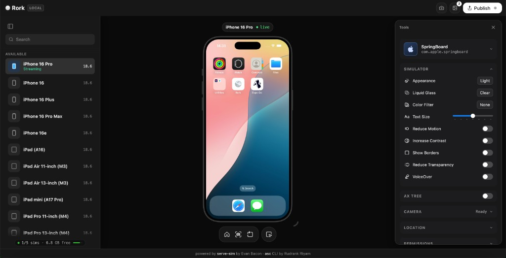

# Rork Local

A localhost, self-hosted take on [Rork](https://rork.com): a browser tab with a live iOS
simulator, a Rork-style **Publish** flow, and App Store **screenshot** tooling. Open it
in Cursor, Claude Code, or any browser-capable agent and iterate on your app end to end.

- Simulator streaming is powered by [`serve-sim`](https://github.com/EvanBacon/serve-sim)
  by [Evan Bacon](https://github.com/EvanBacon) (60 FPS stream, full touch/keyboard input, logs).
- Publishing and screenshots are powered by the [`asc`](https://github.com/rorkai/App-Store-Connect-CLI)
  CLI by [Rudrank Riyam](https://github.com/rudrankriyam) (`asc publish`, `asc screenshots`,
  `asc web apps create`).



_The device switcher and simulator tools panels come from serve-sim._

## Requirements

- macOS (Apple Silicon) with Xcode command line tools (`xcrun simctl`)
- Node.js 20+
- `asc` installed on your `PATH`, or set `ASC_BIN=/path/to/asc`
- `asc auth login` completed (publishing calls the App Store Connect API)
- For screenshot framing: `pipx install "koubou==0.18.1"` (used by `asc screenshots frame`)
- For creating brand-new apps: `asc web auth login` (app creation uses Apple's web API)

## Run

From your app's directory:

```bash
npx rork-local
# → http://localhost:3131
```

Or from a checkout of this repo:

```bash
bun install
bun run build
npm start                            # scans the current directory
node bin/rork-local.mjs /path/to/app # or point it at an app codebase
```

On startup the server:

1. Boots an iPhone simulator if none is booted (and opens Simulator.app).
2. Auto-detects publish settings from your app codebase (see below).
3. Starts the `serve-sim` streaming helper in the background.
4. Serves the UI on `http://localhost:3131` with the simulator mounted at `/.sim`.

Mutable state lives next to your app: overrides in `<project>/rork.config.json`,
screenshots in `<project>/.rork-local/screenshots/`.

## Publish flow (Rork-style)

The **Publish** button opens a popover with an **App Store** section
("Build and submit this app to TestFlight and the App Store"). **Submit to App Store**
opens a bottom-sheet wizard with three steps, modeled on Rork's publish dialog:

1. **App Info** — a **Project** field (edit it to re-point detection at another
   directory; the change is persisted to `rork.config.json`), plus App ID, version,
   IPA path, TestFlight/App Store destination, and beta groups. Everything auto-fills
   Xcode-style from the detected project. No app on App Store Connect yet? When the
   App ID field is empty, a **Create new app** link expands inline fields
   (App Name, Bundle ID, SKU) and runs `asc web apps create` — the new app ID drops
   straight into the form.
2. **App Store Connect** — checks both credentials: **API key (publishing)** via
   `asc auth status`, and **Web session (app creation)** via `asc web auth status`.
3. **Submit** — runs `asc publish testflight|appstore` and streams live progress
   ("Uploading to TestFlight", "Processing", …) plus the raw CLI log. You can close
   the sheet; the publish continues in the background.

## Screenshots

The camera button in the top bar snaps the booted simulator (with a shutter flash).
The screenshots panel lets you:

- **Capture** raw screenshots (`xcrun simctl io booted screenshot`)
- **Frame** them into Apple device bezels (`asc screenshots frame`, Koubou-powered;
  devices: iphone-air, iphone-17-pro, iphone-17-pro-max, iphone-17, iphone-16e),
  producing App-Store-ready sizes (e.g. 1206×2622 → `IPHONE_61`)
- **Accept & Upload** framed (or raw) shots to your App Store listing via
  `asc screenshots upload --app … --version … --device-type …`

Files live in `.rork-local/screenshots/raw/` and `.rork-local/screenshots/framed/`
inside your project.

## Auto-detected defaults

The server continuously scans the project directory and pre-fills the forms:

- **Bundle ID + version** from `app.json` (Expo) or an Xcode `project.pbxproj`
- **IPA path**: the newest `.ipa` found in the project tree
- **App Store Connect app ID**: resolved from the bundle ID via
  `asc apps list --bundle-id …` (requires `asc auth login`)
- **Beta groups**: fetched via `asc testflight groups list --app …`

The project directory resolves in this order: `projectDir` in `rork.config.json` →
`RORK_PROJECT` env → CLI argument → current working directory. Change it live from
the wizard's Project field.

## Defaults

Pre-fill the forms by editing `rork.config.json` (values here always win over
detection):

```json
{
  "projectDir": "/path/to/my-app",
  "appId": "6759231657",
  "ipa": "/path/to/MyApp.ipa",
  "group": "External Testers",
  "version": "1.0.0"
}
```

`ASC_APP_ID` in the environment also pre-fills the app ID.

## Environment

| Variable     | Purpose                          |
| ------------ | -------------------------------- |
| `PORT`       | HTTP port (default `3131`)       |
| `ASC_BIN`    | Path to the `asc` binary         |
| `ASC_APP_ID` | Default App Store Connect app ID |
| `RORK_PROJECT` | App codebase to auto-detect publish settings from (default: cwd) |

## API

| Endpoint | Purpose |
| -------- | ------- |
| `GET /api/status` | Booted device, asc version, config, detection, current job |
| `GET /api/auth` | API-key (`asc auth status`) + web-session (`asc web auth status`) credential status |
| `POST /api/config/detect` | Re-run codebase auto-detection |
| `POST /api/config/project` | Change the project directory and re-detect |
| `POST /api/apps/create` | Create an App Store Connect app (`asc web apps create`) |
| `POST /api/publish` | Start a TestFlight/App Store publish |
| `GET /api/publish/stream` | SSE stream of job status + log lines |
| `POST /api/publish/cancel` | Cancel the running job |
| `GET /api/screenshots` | List raw + framed screenshots |
| `POST /api/screenshots/capture` | Snap the booted simulator |
| `POST /api/screenshots/frame` | Frame a raw shot in a device bezel |
| `POST /api/screenshots/upload` | Upload shots to the App Store listing |
| `DELETE /api/screenshots/:kind/:name` | Delete a raw or framed screenshot |

## Agent Skill

An [Agent Skill](https://platform.claude.com/docs/en/agents-and-tools/agent-skills/overview)
ships in [`skills/rork-local`](skills/rork-local) — it teaches AI coding agents
(Claude Code, Cursor, Codex CLI, and any host implementing the open Agent Skills
standard) how to start rork-local from an app project and drive the whole flow
over HTTP: status/detection, TestFlight and App Store publishing with SSE logs,
screenshot capture/frame/upload, and first-publish app creation.

## Development

The server is TypeScript in `src/`. Bun is the dev/build toolchain (like
serve-sim), but the published artifacts in `dist/` target plain Node — users
running `npx rork-local` don't need Bun:

```
src/
  cli.ts          entry point (bin/rork-local.mjs is a thin shim over dist/cli.js)
  server.ts       Express wiring + HTTP API + boot
  config.ts       paths, rork.config.json, asc binary resolution, project dir
  detect.ts       Xcode-style project detection + caching
  jobs.ts         single-job asc runner + SSE fan-out
  screenshots.ts  simctl capture, asc frame, shot listing
  sim.ts          simulator boot + serve-sim helper
  types.ts        shared API payload types
```

```bash
bun install
bun run build      # bun build → dist/ (node target) + tsc declarations
bun run dev        # run src/cli.ts directly under Bun
bun run typecheck  # tsc --noEmit
npm start          # node bin/rork-local.mjs (runs the built dist/)
```

The browser UI (`public/app.js`) is a plain static asset served as-is — no
bundler, no build step.

## License

Apache 2.0 — see [LICENSE](LICENSE).
